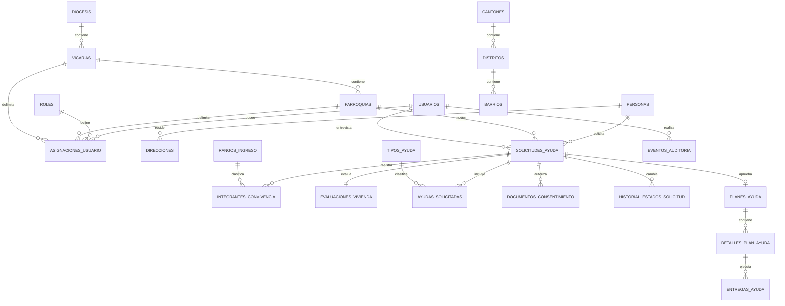

# Modelo de datos — Sistema de Ayudas de la Pastoral Social

## Principios del modelo

- Todo el modelo, sus identificadores y sus valores de catálogo se expresan en español.
- Los identificadores técnicos usan `snake_case`, sin tildes ni `ñ`, para evitar problemas de compatibilidad.
- Una persona existe una sola vez en toda la diócesis y puede tener varias solicitudes históricas o vigentes, siempre que los procesos vigentes correspondan a necesidades distintas.
- La solicitud conserva una fotografía histórica de la información recopilada durante la entrevista.
- El borrado lógico es obligatorio para todos los registros operativos y catálogos.
- Los eventos de auditoría son inmutables y no se pueden modificar ni borrar desde la aplicación.
- Los archivos privados se identifican por su bucket y clave de objeto; nunca se guarda una URL pública permanente.

## Convenciones comunes

Todas las tablas operativas y de catálogo deben incluir:

- `id`: UUID, llave primaria.
- `creado_en`: fecha y hora de creación.
- `creado_por_usuario_id`: usuario que creó el registro, cuando corresponda.
- `actualizado_en`: fecha y hora de la última modificación.
- `actualizado_por_usuario_id`: usuario que realizó la última modificación.
- `eliminado_en`: fecha y hora del borrado lógico; `NULL` significa que el registro está activo.
- `eliminado_por_usuario_id`: usuario que realizó el borrado lógico.
- `motivo_eliminacion`: justificación obligatoria cuando `eliminado_en` tenga un valor.

`eliminado_en` es la fuente oficial para determinar si un registro está eliminado. No se agrega un booleano `eliminado`, porque podría contradecir la fecha de eliminación.

Las consultas normales deben filtrar `eliminado_en IS NULL`. Las restricciones de unicidad deben aplicarse únicamente a registros no eliminados mediante índices únicos parciales.

Las tablas `eventos_auditoria` e `historial_estados_solicitud` son excepciones: sus registros son inmutables y no admiten borrado lógico desde la aplicación, porque su objetivo es preservar evidencia histórica.

## Estructura general

## Organización eclesial

### `diocesis`

- `id`
- `nombre`
- `codigo`: identificador interno de control. Si no se indica al crear, la BD asigna `D01`, `D02`, … (no es UUID). Se puede enviar un valor explícito si más adelante existe un código institucional.
- Campos comunes de auditoría y borrado lógico.

### `vicarias`

- `id`
- `diocesis_id`
- `nombre`
- `codigo`: si no se indica, la BD asigna `{codigo_diócesis}-V01` (p. ej. `D01-V01`).
- Campos comunes.

### `parroquias`

- `id`
- `vicaria_id`
- `nombre`
- `codigo`: si no se indica, la BD asigna `{codigo_vicaría}-P001` (p. ej. `D01-V01-P001`).
- Campos comunes.

Relación jerárquica:

`diócesis → vicarías → parroquias`

En el formulario:

- `parroquia_receptora_id` representa la parroquia que recibe y administra la solicitud.
- `sector_oficial` es un campo de texto abierto.

La interfaz seleccionará primero la vicaría y después mostrará únicamente sus parroquias para el campo “Parroquia de”. La vicaría no necesita duplicarse en la solicitud porque se obtiene desde la parroquia seleccionada. Por ahora, el sector oficial no se valida contra ningún catálogo; solamente se eliminan espacios al inicio y al final antes de guardarlo.

## Personas y ubicación

### `personas`

- `id`
- `tipo_documento_id`
- `numero_documento_cifrado`
- `numero_documento_hash`
- `primer_nombre`
- `segundo_nombre`
- `primer_apellido`
- `segundo_apellido`
- `telefono`
- Campos comunes.

Reglas:

- `numero_documento_hash` se calcula a partir del documento normalizado y permite detectar duplicados sin buscar sobre el valor cifrado.
- Debe existir un índice único parcial sobre `numero_documento_hash` cuando no sea nulo y el registro no esté eliminado.
- El modelo debe permitir personas extranjeras, menores o personas sin documento.
- El documento y el teléfono se consideran datos sensibles y no deben escribirse sin protección en bitácoras.

### `tipos_documento`

Catálogo inicial:

- `CEDULA_NACIONAL`
- `DIMEX`
- `PASAPORTE`
- `OTRO`
- `SIN_DOCUMENTO`

Campos: `id`, `codigo`, `nombre` y campos comunes.

### `direcciones`

- `id`
- `persona_id`
- `canton_id`
- `distrito_id`
- `barrio_id`
- `senas`
- `es_actual`
- `vigente_desde`
- `vigente_hasta`
- Campos comunes.

Solo puede existir una dirección actual no eliminada por persona.

### `cantones`, `distritos` y `barrios`

Catálogos jerárquicos para evitar diferencias ortográficas y facilitar filtros geográficos:

- `distritos.canton_id`
- `barrios.distrito_id`
- `codigo` (único entre barrios activos a nivel provincial, p. ej. `BA-001`)
- `nombre`
- Campos comunes.

## Solicitudes

### `solicitudes_ayuda`

- `id`
- `numero_solicitud`
- `persona_solicitante_id`
- `parroquia_receptora_id`
- `sector_oficial`
- `usuario_entrevistador_id`
- `fecha_entrevista`
- `fecha_visita`
- `estado`
- `observaciones`
- `presentada_en`
- Campos comunes.

Valores de `estado`:

- `BORRADOR`
- `PRESENTADA`
- `EN_REVISION`
- `APROBADA`
- `ACTIVA`
- `RECHAZADA`
- `FINALIZADA`
- `CANCELADA`

Reglas:

- `numero_solicitud` es único entre solicitudes no eliminadas.
- Una solicitud eliminada lógicamente no desaparece de la auditoría.
- Todo cambio de estado genera un registro en `historial_estados_solicitud`.
- La transición de estados debe validarse en el servicio de dominio y registrarse dentro de la misma transacción.

### Prevención de ayudas simultáneas para una misma necesidad

Una persona puede tener varias solicitudes vigentes únicamente cuando sus tipos de ayuda no se superpongan. Por ejemplo, puede tener una ayuda de alimentos activa y presentar una solicitud de equipo médico, pero no puede abrir otra solicitud de alimentos mientras la primera siga vigente.

Se consideran procesos vigentes las solicitudes en alguno de estos estados:

- `PRESENTADA`
- `EN_REVISION`
- `APROBADA`
- `ACTIVA`

La regla se evalúa comparando los registros no eliminados de `ayudas_solicitadas` por `tipo_ayuda_id`. No puede implementarse correctamente con un índice simple porque la persona y el estado pertenecen a `solicitudes_ayuda`, mientras el tipo de necesidad pertenece a `ayudas_solicitadas`.

En PostgreSQL debe implementarse mediante una función transaccional que:

1. Obtenga un bloqueo transaccional para `persona_solicitante_id`, evitando solicitudes concurrentes desde dos parroquias.
2. Consulte los tipos de ayuda incluidos en procesos vigentes de esa persona.
3. Rechace la operación si alguno coincide con un tipo de ayuda de la nueva solicitud.
4. Inserte la solicitud y sus ayudas solicitadas dentro de la misma transacción.

La misma validación se ejecuta cuando se agrega un tipo de ayuda a una solicitud existente o cuando una solicitud cambia a un estado vigente. La interfaz puede mostrar la advertencia antes, pero la base de datos debe garantizar la regla frente a concurrencia.

### `historial_estados_solicitud`

- `id`
- `solicitud_ayuda_id`
- `estado_anterior`
- `estado_nuevo`
- `motivo`
- `usuario_responsable_id`
- `ocurrido_en`

Es una tabla inmutable y de inserción exclusiva. No admite actualización ni eliminación desde la aplicación.

## Grupo familiar o de convivencia

### `integrantes_convivencia`

- `id`
- `solicitud_ayuda_id`
- `persona_id`, opcional si el integrante ya está registrado como persona global.
- `nombre_completo`
- `sexo_id`
- `ocupacion`
- `tipo_documento_id`
- `numero_documento_cifrado`
- `numero_documento_hash`
- `grado_academico_id`
- `rango_ingreso_id`
- `cuenta_con_seguro`
- `parentesco_id`
- Campos comunes.

Estos datos pertenecen a la solicitud para conservar la composición familiar tal como se declaró durante la entrevista. `persona_id` permite relacionar al integrante si posteriormente presenta una solicitud propia.

El ingreso mensual se recopila mediante un rango, no como monto exacto.

### `rangos_ingreso`

- `id`
- `codigo`
- `nombre`
- `monto_minimo`, opcional para rangos sin límite inferior.
- `monto_maximo`, opcional para rangos sin límite superior.
- `orden_presentacion`
- Campos comunes.

Valores iniciales:

1. `SIN_INGRESOS_REPORTADOS`: Sin ingresos reportados.
2. `HASTA_100000`: Hasta ₡100.000.
3. `DE_100001_A_180000`: ₡100.001 - ₡180.000.
4. `DE_180001_A_280000`: ₡180.001 - ₡280.000.
5. `DE_280001_A_380000`: ₡280.001 - ₡380.000.
6. `DE_380001_A_460000`: ₡380.001 - ₡460.000.
7. `DE_460001_A_550000`: ₡460.001 - ₡550.000.
8. `MAS_DE_550000`: Más de ₡550.000.

Los rangos son continuos y no dejan montos sin clasificar. `SIN_INGRESOS_REPORTADOS` representa ausencia de ingresos; `HASTA_100000` comienza en el primer monto positivo.

Catálogos relacionados:

- `sexos`
- `grados_academicos`
- `parentescos`

Todos incluyen `id`, `codigo`, `nombre`, orden de presentación y campos comunes.

## Vivienda

### `evaluaciones_vivienda`

- `id`
- `solicitud_ayuda_id`
- `tipo_vivienda_id`
- `tipo_tenencia_id`
- `condicion_vivienda_id`
- `observaciones`
- Campos comunes.

Cada grupo representa una selección única, por lo que se utilizan llaves foráneas en lugar de múltiples columnas booleanas.

### Catálogos de vivienda

`tipos_vivienda`:

- `CASA`
- `CUARTO`
- `ALBERGUE`
- `REFUGIO`

`tipos_tenencia`:

- `PROPIA`
- `HIPOTECADA`
- `PRESTADA`
- `ALQUILADA`
- `NO_TIENE`

`condiciones_vivienda`:

- `BUENA`
- `REGULAR`
- `MALA`
- `PRECARIO`
- `TUGURIO`

Todos incluyen `id`, `codigo`, `nombre` y campos comunes.

## Ayuda solicitada, aprobación y entrega

### `tipos_ayuda`

Catálogo inicial:

- `ALIMENTOS`
- `ALIMENTOS_PREPARADOS`
- `ARTICULOS_HIGIENE`
- `ROPA`
- `EQUIPO_MEDICO`
- `PAGO_ALQUILER`
- `PAGO_SERVICIOS`
- `PAGO_MEDICAMENTOS`
- `APARATOS_ORTOPEDICOS`
- `OTROS`

Campos: `id`, `codigo`, `nombre`, `requiere_detalle` y campos comunes.

### `ayudas_solicitadas`

- `id`
- `solicitud_ayuda_id`
- `tipo_ayuda_id`
- `detalle`
- Campos comunes.

Existe una restricción única parcial sobre solicitud y tipo de ayuda para evitar selecciones repetidas no eliminadas.

### `planes_ayuda`

- `id`
- `solicitud_ayuda_id`
- `decision`
- `fecha_inicio`
- `fecha_fin`
- `motivo_decision`
- `usuario_decisor_id`
- `decidido_en`
- Campos comunes.

Valores de `decision`: `APROBADA` o `RECHAZADA`.

La duración se obtiene de `fecha_inicio` y `fecha_fin`; no debe duplicarse como meses salvo que se requiera guardar literalmente la opción escogida en el formulario.

### `detalles_plan_ayuda`

- `id`
- `plan_ayuda_id`
- `tipo_ayuda_id`
- `descripcion`
- `frecuencia`
- `monto_estimado`
- Campos comunes.

### `entregas_ayuda`

- `id`
- `detalle_plan_ayuda_id`
- `fecha_entrega`
- `descripcion`
- `monto`
- `usuario_responsable_id`
- `observaciones`
- Campos comunes.

Separar el plan de sus entregas permite conocer qué se aprobó, qué se entregó realmente y qué entregas siguen pendientes.

## Consentimiento informado

### `documentos_consentimiento`

- `id`
- `solicitud_ayuda_id`
- `nombre_bucket`
- `clave_objeto`
- `nombre_archivo_original`
- `tipo_mime`
- `tamano_bytes`
- `suma_verificacion`
- `fecha_firma`
- `usuario_carga_id`
- `cargado_en`
- Campos comunes.

Reglas:

- El bucket es privado.
- Se guarda `clave_objeto`, no una URL pública.
- La aplicación genera una URL firmada de corta duración para usuarios autorizados.
- La visualización o descarga del documento genera un evento de auditoría.
- El borrado lógico del registro no elimina automáticamente el archivo; una política de retención independiente decide cuándo puede eliminarse físicamente.

## Usuarios, roles y alcance

### `usuarios`

- `id`
- `identidad_autenticacion_id`
- `nombre_completo`
- `correo`
- `activo`
- `ultimo_acceso_en`
- Campos comunes.

### `roles`

Roles iniciales:

- `PERSONAL_PASTORAL`
- `COORDINADOR_PARROQUIAL`
- `COORDINADOR_VICARIAL`
- `COORDINADOR_DIOCESANO`
- `ADMINISTRADOR`

El párroco y el coordinador parroquial representan el mismo rol: `COORDINADOR_PARROQUIAL`.

### `asignaciones_usuario`

- `id`
- `usuario_id`
- `rol_id`
- `diocesis_id`, opcional.
- `vicaria_id`, opcional.
- `parroquia_id`, opcional.
- `vigente_desde`
- `vigente_hasta`
- Campos comunes.

Reglas de alcance:

- `PERSONAL_PASTORAL`: lectura y escritura en su parroquia.
- `COORDINADOR_PARROQUIAL`: acceso a su parroquia.
- `COORDINADOR_VICARIAL`: acceso a todas las parroquias de su vicaría.
- `COORDINADOR_DIOCESANO`: acceso a toda la diócesis.
- `ADMINISTRADOR`: acceso total en todos los niveles (diócesis, vicaría y parroquia), con alcance territorial opcional de un solo nivel para ubicar la asignación.
- Una asignación debe tener exactamente el alcance requerido por el rol; por ejemplo, un coordinador vicarial requiere `vicaria_id` y no `parroquia_id`. El administrador puede omitir alcance o indicar un único nivel.
- La creación de usuarios y la asignación de su rol y alcance se ejecutan en una sola operación transaccional.

Reglas de creación de usuarios:

- `PERSONAL_PASTORAL` puede crear únicamente usuarios `PERSONAL_PASTORAL` para su misma parroquia.
- `COORDINADOR_PARROQUIAL` puede crear únicamente usuarios `PERSONAL_PASTORAL` para su parroquia.
- `COORDINADOR_VICARIAL` puede crear únicamente usuarios `COORDINADOR_PARROQUIAL` para parroquias pertenecientes a su vicaría.
- `COORDINADOR_DIOCESANO` puede crear únicamente usuarios `COORDINADOR_VICARIAL` para vicarías de la diócesis.
- `ADMINISTRADOR` puede crear usuarios de cualquier rol y asignarlos a cualquier alcance válido.
- Ningún usuario puede asignarse a sí mismo otro rol o alcance.
- Toda creación de usuario o cambio posterior de rol, estado o alcance genera un evento de auditoría.

## Auditoría

### `eventos_auditoria`

- `id`: UUID.
- `ocurrido_en`: fecha y hora exacta.
- `usuario_id`: usuario autenticado; puede ser nulo para procesos automáticos.
- `rol_codigo`: rol efectivo utilizado en la operación.
- `tipo_actor`: `USUARIO`, `SISTEMA` o `TAREA_AUTOMATICA`.
- `accion`: acción normalizada.
- `tipo_entidad`: nombre lógico de la entidad afectada.
- `entidad_id`: identificador del registro afectado.
- `diocesis_id`, `vicaria_id` y `parroquia_id`: alcance efectivo de la operación.
- `datos_anteriores`: JSON con valores anteriores permitidos.
- `datos_nuevos`: JSON con valores nuevos permitidos.
- `campos_modificados`: lista de campos modificados.
- `motivo`: justificación cuando la operación la requiera.
- `resultado`: `EXITOSO` o `FALLIDO`.
- `codigo_error`: código controlado si la operación falló.
- `direccion_ip`: dirección IP del cliente.
- `agente_usuario`: navegador o cliente utilizado.
- `identificador_sesion`: sesión autenticada.
- `identificador_solicitud`: identificador de correlación para agrupar toda una operación.
- `origen`: aplicación, API, tarea programada o consola administrativa.

Acciones mínimas:

- `INICIAR_SESION`
- `CERRAR_SESION`
- `FALLAR_INICIO_SESION`
- `CONSULTAR_EXPEDIENTE`
- `BUSCAR_PERSONA`
- `CREAR`
- `ACTUALIZAR`
- `ELIMINAR_LOGICAMENTE`
- `RESTAURAR`
- `CAMBIAR_ESTADO_SOLICITUD`
- `APROBAR_AYUDA`
- `RECHAZAR_AYUDA`
- `REGISTRAR_ENTREGA`
- `CREAR_USUARIO`
- `CAMBIAR_ROL`
- `CAMBIAR_ALCANCE`
- `DESACTIVAR_USUARIO`
- `CARGAR_DOCUMENTO`
- `VISUALIZAR_DOCUMENTO`
- `DESCARGAR_DOCUMENTO`
- `EXPORTAR_DATOS`

Reglas de implementación:

- La tabla es de solo inserción. La cuenta de la aplicación no recibe permisos `UPDATE` ni `DELETE`.
- Las escrituras, cambios y borrados lógicos se auditan mediante funciones o disparadores de base de datos.
- Las lecturas, búsquedas, descargas y accesos fallidos se auditan desde el servicio de aplicación, porque un disparador no puede registrar correctamente una consulta de lectura.
- El evento se escribe dentro de la misma transacción que la operación principal cuando sea posible.
- Los JSON de valores anteriores y nuevos excluyen o enmascaran cédulas, teléfonos, tokens, URLs firmadas y otros secretos.
- La auditoría debe particionarse por fecha cuando aumente su volumen.
- El acceso a eventos de auditoría queda limitado al coordinador diocesano y al administrador.
- La aplicación no ofrece ninguna operación para eliminar eventos de auditoría.

## Retención de datos

Actualmente la institución no cuenta con una política formal de retención y los documentos físicos se conservan indefinidamente. Por esa razón, el sistema no debe implementar un plazo arbitrario de dos años ni activar una purga automática.

Hasta que exista una política aprobada:

- Los registros operativos utilizan borrado lógico y se conservan sin fecha automática de purga.
- Los documentos de consentimiento permanecen en almacenamiento privado.
- Los eventos de auditoría se conservan de forma indefinida y siguen siendo inmutables para la aplicación.
- No se realiza eliminación física ni anonimización automática.

Esta conservación indefinida debe considerarse una medida transitoria, no una política definitiva. Antes de producción, la diócesis debe definir una política institucional con asesoría aplicable a protección de datos personales, consentimientos, documentación de ayudas y registros contables. La política futura deberá establecer plazos, eventos desde los cuales se calculan y excepciones por procesos activos u obligaciones legales.

## Restricciones y seguridad

- Todas las llaves foráneas deben impedir la eliminación física accidental de registros relacionados.
- Los catálogos usados históricamente se desactivan mediante borrado lógico; no se eliminan físicamente.
- Las políticas de acceso deben aplicarse en el servidor y, si se utiliza PostgreSQL/Supabase, reforzarse con seguridad por fila.
- Los coordinadores no pueden ampliar su propio alcance ni asignar un rol superior al permitido.
- Las búsquedas interparroquiales deben revelar solamente la información necesaria para detectar un proceso vigente; el expediente completo depende del rol y alcance.
- La detección interparroquial compara cada tipo de ayuda solicitado y permite continuar solamente con necesidades que no estén presentes en otro proceso vigente.
- La cédula, teléfono, dirección, composición familiar, ingresos y consentimiento deben cifrarse o protegerse según su sensibilidad.
- Las restauraciones de registros eliminados también requieren autorización, motivo y evento de auditoría.
- Ninguna operación debe reutilizar un registro eliminado sin una restauración explícita y auditada.

## Configuración futura

La política institucional de retención y eliminación definitiva de datos y documentos se definirá posteriormente. Esto no bloquea las migraciones iniciales: hasta que se apruebe y configure la política, no habrá purga automática.
